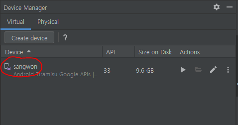
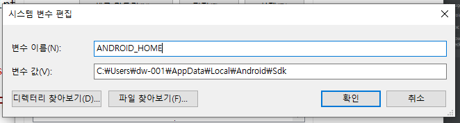
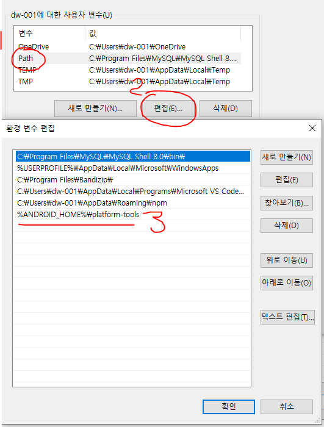

## react-native run android 환경 구성

1. 안드로이드, JDK 설치

2. SDK Tools 아래 리스트 다운 (사진 참고)
    - Android SDK Build-Tools
    - Android Emulator
    - Android SDK Platform - Tools
    - Android SDK Tools (Obsolete)
    - Intel x86 Emulator Accelerator
    - Google Play Services : 이건 나중에 배포할 때


3. Device Manger -> Create virtual device

4. AVD 이름 지정 (사진 참고)



## cmd로 애뮬레이터 실행 환경 구성

1. 고급 시스템 설정 -> 고급 -> 환경변수 

2. 환경변수 추가 (사진 참고)



3. PATH 추가 (사진 참고)



4. 아래 명령어 실행 

```bash
%ANDROID_HOME%\tools\emulator -avd sangwon
```


### Expo -> 애뮬레이터 연동

1. 아래 명령어 실행

```bash
npx expo start
```

2. a 누르고 엔터 (애뮬레이터로 다운로딩 될꺼임)