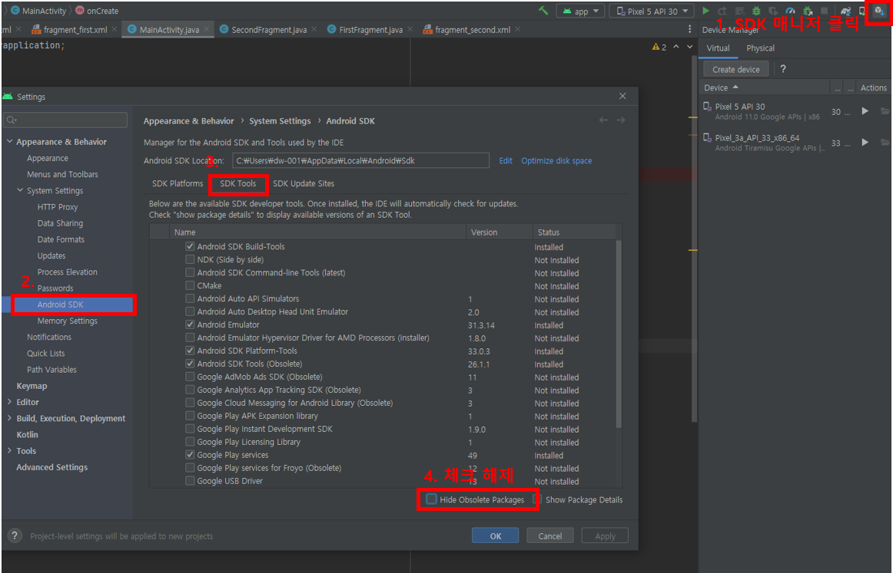

## react-native run android 환경세팅

1. 안드로이드, JDK 설치

2. SDK Tools 아래 리스트 다운 (사진 참고)
    - Android SDK Build-Tools
    - Android Emulator
    - Android SDK Platform - Tools
    - Android SDK Tools (Obsolete)
    - Intel x86 Emulator Accelerator
    - Google Play Services : 이건 나중에 배포할 때



3. Device Manger -> Create virtual device

4. 시뮬레이터 실행 

5. RN 프로젝트에서 아래 명령어 실행

```bash
npx react-native run-android
```